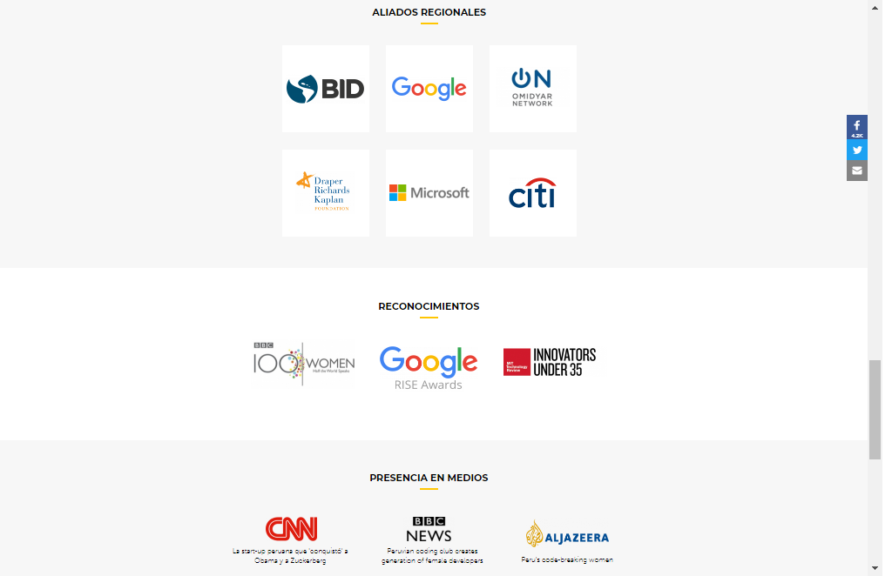
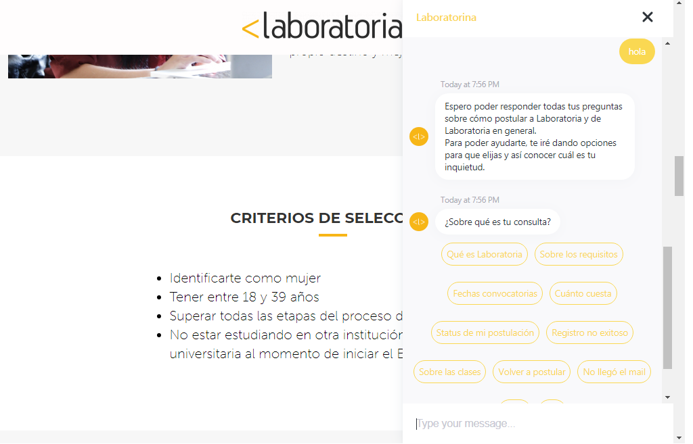

# Pagina Laboratoria:ux-ui

## Partes del ux

### **Informacion:**

### El ux se encarga de seleccionar lo mas importante, la informacion en especifico que necesita mostrar el cliente y la informacion detallada que necesita saber el usuario.

 
 

### **arquitectura:**

###  la informacion, las imagenes y otros elementos se han distribuido de manera vertical para manejar la manera en que el usuario navegara por la pagina.

### **clasifica:**

### divide la informacion de acuerdo al usuario-postulante y al usuario-empresarial en dos opciones: estudiantes-empresas.

### **acceso persistente a las redes sociales**

### la disposición de iconos en todo momento en el que navega el usuario es persistente,en la sección "blogs" tambien persisten estos iconos pero de manera sugerida al colocar el pulsor en cada blog.

### **influenciar**

### el ux en todo momento debe destacar que es lo que hace unico el producto o servicio y destacar sus virtudes,generando confianza en los usuarios. los reconocimientos,impacto y aliados son un ejemplo de ello.

### **testimonios**

### al brindar testimonios o experiencias de personas que han  experimentado el servicio,genera en el usuario confianza,motivacion e identificarse con algunos hechos o vivencias que se comparte en la pagina.

### **contacto directo**

### por medio de un chat se le brinda al usuario la facilidad de poder contactar en tiempo real a la empresa y asi poder realizar cualquier consulta desde el lugar en el que se encuentre.

## Partes del UI:

### **colores**

### se decide que colores se van a definir tanto para la marca del producto,como a sus elementos(buttons,parrafos,enlaces,etc).

### **tipografia**

### establecer el tipo de letra que se tiene para los títulos, parrafos y subtítulos, etc.

### **
